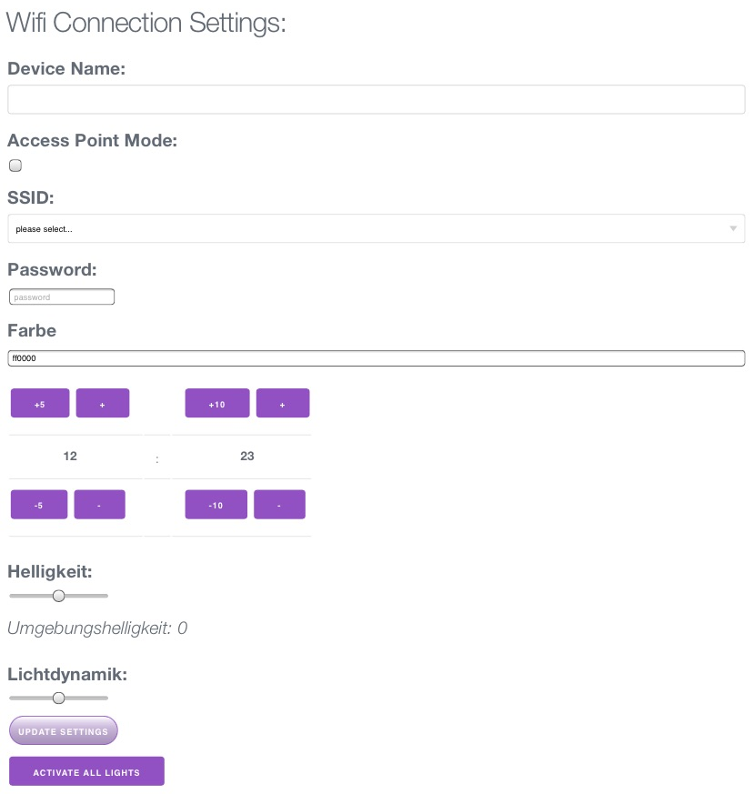

# WordClock
Arduino Sketch with software for a wordclock controlled by a esp8266 chip and powered by a ws2812 led stripe

# clock.ino
is the arduino sketch with the firmware

# folder website
contains code for the administration website, based on simple html and a minimal ajax framework, created with node.js
the script "build.js" copies the website content into the rootfolder and convert them to c header files for static inclusion of the website content.

# initialization
For the first run the clock has to be configured.
Configuration could be done with a mobile phone.

1. Power On the Clock
2. Connect to the WiFi "workclock"  and provide the password "00000000" (8 x 0)

3. Open the clock config-screen using URL http://192.168.4.1

4. change settings you like
   
   1. select a WiFi-Network in the SSID-List, enter the password end press "Update Settings" below
      the clock will restart, connect to the WiFi and get's the time through the internet
      if WiFi access is not possible it will again open a WiFi
   2. press "Farbe" to select a Color
      when touching a color it's changed directly on the watch but only when pressing "Update Settings" it will be stored after the next reboot (e.g. power-off/on)
   3. when internet connection is not available you can configure the current time manually by pressing + / -  for Hours and Minuts
   4. "Helligkeit" adjust the brightness of the Watch
   5. "Lichtdynamic" is currently not supported
   6. Activate All Lights does what it says :-)

